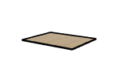

# Golf Chipping Platform
Improve your chipping game anywhere—even on uneven ground!
This sturdy, adjustable platform provides a stable, level surface so you can practice with confidence.
Designed with leveling feet and an integrated bubble level, it ensures a consistent stance for better performance.
Perfect for backyard practice or training!

The final CAD is available in the [cad/](cad/) folder and a preview online at [https://a360.co/3FmtlC6](https://a360.co/3FmtlC6). 

> [!INFO]
> This project includes affiliate links. If you click on these links, I may earn a commission or credit. This does not cost you anything extra, but it helps support the project and future development efforts. Thank you for your support!

## Bill of Materials
The following BOM was automatically generated using [tallman5/fusion-scripts](https://github.com/tallman5/fusion-scripts).

|Image|Part|Description|Quantity|
|-|-|-|-|
||.25 in Hex Nut|Affiliate Link: https://amzn.to/4hm1ajV|4|
||.25 in Tee Nut|Affiliate Link: https://amzn.to/4bI0S5J|4|
||1/4 x 2" Hex Bolt|Affiliate Link: https://amzn.to/4hm1ajV|4|
||Bubble Level|Affiliate Link: https://amzn.to/43Ag8j7|1|
||Deck|60" x 48" x 3/4"|1|
||Footer Long|59 1/1" x 3 1/2" x 1 1/2"|2|
||Footer Short|44 1/1" x 3 1/2" x 1 1/2"|6|
||Golf Matt Assembly|Affiliate Link: https://amzn.to/3Dr7J77|1|
||Platform Foot|3" x 2 3/5" x 1" Pressure Treated|4|
||Wood Screw 2.5in|Affiliate Link: https://amzn.to/41nn14P|54|