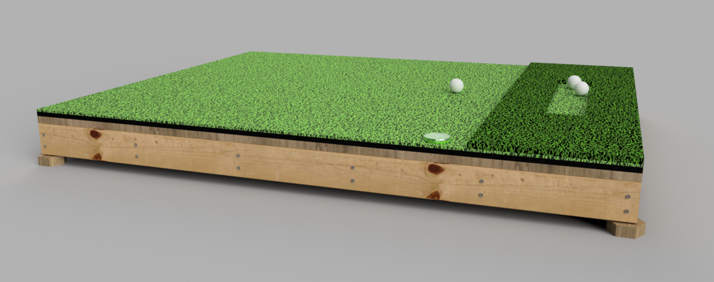
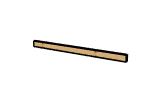

# Golf Chipping Platform
Improve your chipping game anywhere, even on uneven ground!
This sturdy, adjustable platform provides a stable, level surface so you can practice with confidence.
Designed with leveling feet and an integrated bubble level, it ensures a consistent stance for better performance.
Perfect for backyard practice or training!

The final CAD is available in the [cad/](cad/) folder and a preview online at [https://a360.co/3FmtlC6](https://a360.co/3FmtlC6). 

## Bill of Materials

> [!NOTE]
> This BOM includes affiliate links. If you click on these links, I may earn a commission or credit. This does not cost you anything extra, but it helps support the project and future development efforts. Thank you for your support!

|Image|Part|Description|Quantity|
|-|-|-|-|
||1/4" Hex Nut|Buy Now: https://amzn.to/4hm1ajV|4|
||1/4" Tee Nut|Buy Now: https://amzn.to/4bI0S5J|4|
||1/4" x 2" Hex Bolt|Buy Now: https://amzn.to/4hm1ajV|4|
||Bubble Level|Buy Now: https://amzn.to/43Ag8j7|1|
||Deck|60" x 48" x 3/4" Pressure Treated|1|
||Footer Long|60" x 3-1/2" x 1-1/2" Pressure Treated|2|
||Footer Short|45" x 3-1/2" x 1-1/2" Pressure Treated|6|
||Golf Matt|Buy Now: https://amzn.to/3Dr7J77|1|
||Platform Foot|3-6/13" x 3" x 1-1/2" Pressure Treated|4|
||#9 x 2-1/2" Wood Screw|Buy Now: https://amzn.to/41nn14P|54|

The above BOM was automatically generated using [tallman5/fusion-scripts](https://github.com/tallman5/fusion-scripts).
