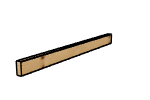
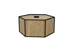

# Golf Chipping Platform BOM

|Image|Name|Number|Description|Quantity|Dimensions|
|-|-|-|-|-|-|
||.25 in Hex Nut v3:1|.25 in Hex Nut|Affiliate Link: https://amzn.to/4hm1ajV|4||
||.25 in Tee Nut v3:1|.25 in Tee Nut|Affiliate Link: https://amzn.to/4bI0S5J|4||
||.25x2 in Hex Bolt v3:1|.25x2 in Hex Bolt|Affiliate Link: https://amzn.to/4hm1ajV|4||
||Bubble Level v4:1|Bubble Level|Affiliate Link: https://amzn.to/43Ag8j7|1||
||Deck v2:1|Deck||1|60" x 48" x 3/4"|
||Footer Long v3:1|Footer Long||2|59 1/1" x 3 1/2" x 1 1/2"|
||Footer Short v3:1|Footer Short||5|44 1/1" x 3 1/2" x 1 1/2"|
||Golf Matt Assembly v3:1|Golf Matt Assembly|Affiliate Link: https://amzn.to/3Dr7J77|1||
||No 8 x 1.25in v3:1|No 8 x 1.25in|Affiliate Link: https://amzn.to/3DvXDlk|25||
||Platform Foot v1:1|Platform Foot||4||
||Wood Screw 2.5in v2:1|Wood Screw 2.5in|Affiliate Link: https://amzn.to/41nn14P|20||